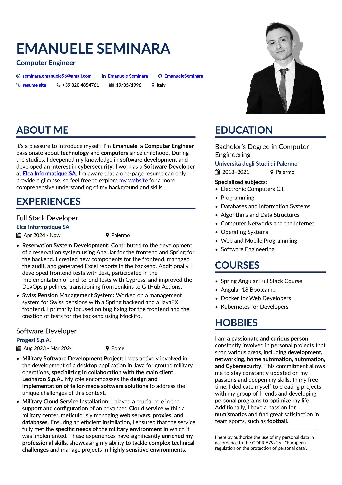

# [](https://emanueleseminara.it/) AltaCV - One Page LaTeX CV [](https://emanueleseminara.it/)

v1.3 (20 Genuary 2024) by Emanuele Seminara

[For the italian version Click Here](https://github.com/EmanueleSeminara/LaTeX_resume/tree/ITA)
## Intro

This repo is meant to give you, LaTeX lover, a cool idea for a resume.
You can use this template to create your own personal CV in few minutes.

Below you can find a selection of point to follow to customize your CV, have fun.
For any question you can write me at [seminara.emanuele96@gmail.com](mailto:seminara.emanuele96@gmail.com).

You can also find me on:

[](https://www.linkedin.com/in/emanuele-seminara/)
[](https://www.instagram.com/emanuele_seminara/)
[](https://emanueleseminara.it/)
[](https://tech-fusion.it/)

## Resume Look


## Editor
In case you don't know LaTeX, don't worry, you can use [Overleaf](https://overleaf.com), it is a cool online free editor,
just create an account, create a new project and load the files inside this repo.

To have the files on your pc just clone this repo:

1) select the location where you want to store the files in your terminal

   ```bash
   cd Projects/resume
   ```

2) clone the repo

   ```bash
   git clone https://github.com/EmanueleSeminara/LaTeX_resume.git
   ```

After you have loaded the files you will need only to change the file's contents in order to write whatever you want in your resume.
It is really intuitive, in case you need more info on what to modify you can check the following sections.

## Requirements and Compilation

* At line 76 of main you can insert your personal info
* page1sidebar.tex contains the code for the right part of the cv
* remember to substitute the image with your photo and use a png format
* If you would like to change the colors go at line 48 of main.tex
* AltaCV uses [`fontawesome`](http://www.ctan.org/pkg/fontawesome) and [`academicons`](http://www.ctan.org/pkg/academicons); they're included in both TeX Live 2016 and MikTeX 2.9.
* Loading `academicons` is optional: enable it by adding the `academicons` option to `\documentclass`.
* Can now be compiled with pdflatex, XeLaTeX and LuaLaTeX!
* However if you're using `academicons`, you _must_ use either XeLaTeX or LuaLaTeX. If the doc then compiles but the icons don't show up in the output PDF, try compiling with LuaLaTeX instead.
* The samples here use the [Lato](http://www.latofonts.com/lato-free-fonts/) font.

## Donations
The code is here for you to be read, edited, modified, reused, for free, do whatever you want!
However, if you'd like to offer me a coffee or a beer, then cheers! =D

[](https://www.buymeacoffee.com/emanueleseminara)