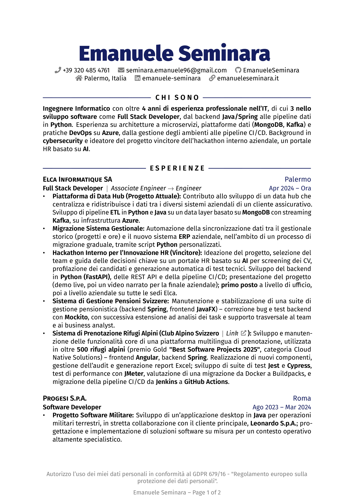
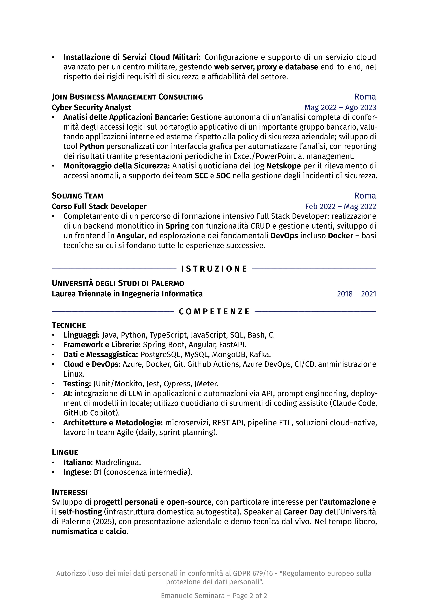

# [](https://emanueleseminara.it/) Rover Resume - CV in LaTeX [](https://emanueleseminara.it/)

v2.0 (16 Febbraio 2025) di Emanuele Seminara

[Per la versione inglese Clicca Qui](https://github.com/EmanueleSeminara/LaTeX_resume/tree/ENG)

## Introduzione

Questo repository è pensato per te, amante di LaTeX, per darti un'idea interessante per un curriculum vitae.
Puoi utilizzare questo modello per creare in pochi minuti il tuo curriculum personale.

Per qualsiasi domanda puoi scrivermi a [seminara.emanuele96@gmail.com](mailto:seminara.emanuele96@gmail.com).

Puoi trovarmi anche su:

[](https://www.linkedin.com/in/emanuele-seminara/)
[](https://www.instagram.com/emanuele_seminara/)
[](https://emanueleseminara.it/)

## Aspetto del Curriculum




## Editor

Nel caso tu non conosca LaTeX, non preoccuparti, puoi utilizzare [Overleaf](https://overleaf.com), un editor online gratuito e fantastico,
basta creare un account, avviare un nuovo progetto e caricare i file di questo repository.

Per avere i file sul tuo PC, clona semplicemente questo repository:

1. Seleziona la posizione in cui desideri memorizzare il file nel tuo terminale

   ```bash
   cd Progetti/curriculum
   ```

2. Clona il repository

   ```bash
   git clone https://github.com/EmanueleSeminara/LaTeX_resume.git
   ```

Dopo aver caricato i file, dovrai solo modificare il contenuto dei file per scrivere ciò che desideri nel tuo curriculum.
È davvero intuitivo, nel caso tu abbia bisogno di ulteriori informazioni su cosa modificare, puoi consultare le sezioni seguenti.

## Donazioni

Il codice è qui per essere letto, modificato, adattato, riutilizzato, gratuitamente, fai quello che vuoi!
Tuttavia, se desideri offrirmi un caffè o una birra, allora cin cin! =D

[](https://www.buymeacoffee.com/emanueleseminara)
