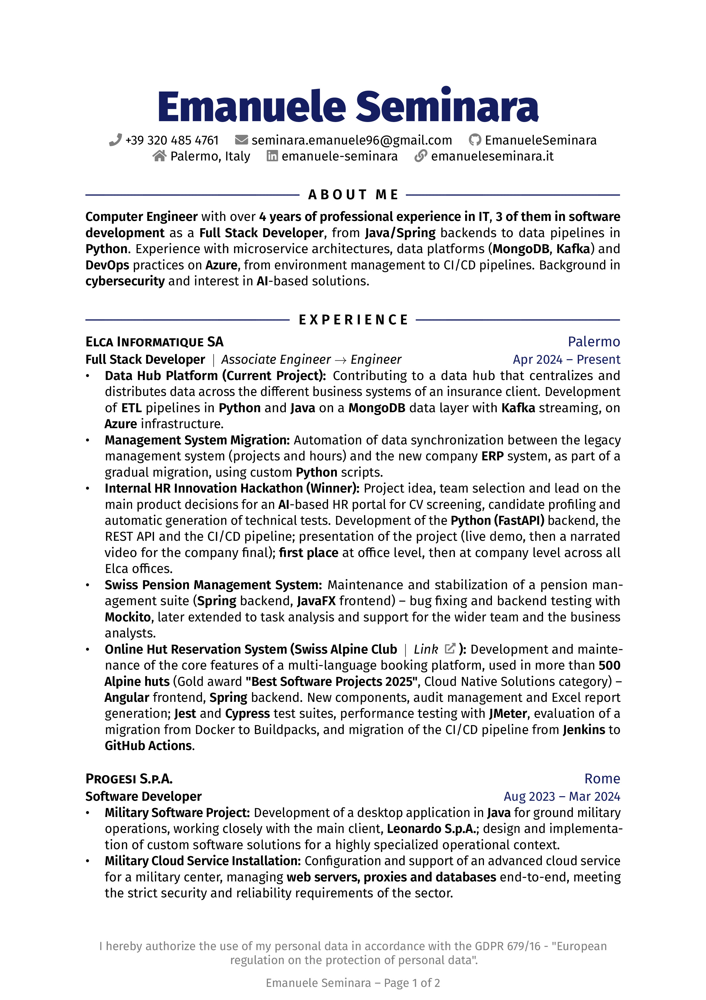
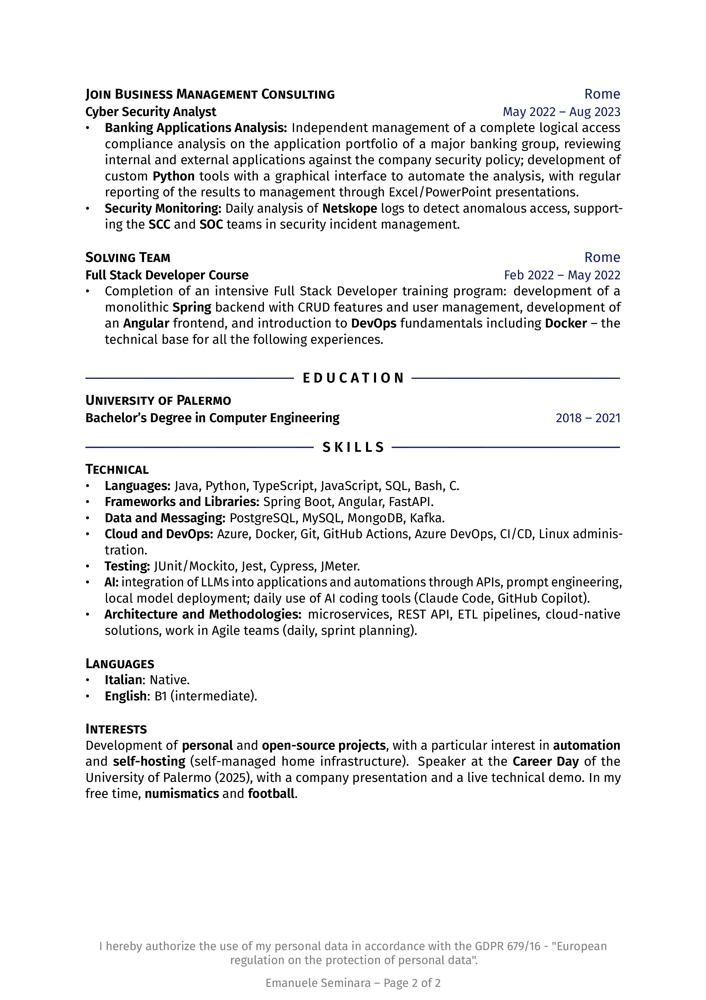

# [](https://emanueleseminara.it/) Rover Resume - LaTeX CV [](https://emanueleseminara.it/)

v2.0 (16 February 2025) by Emanuele Seminara

[For the italian version Click Here](https://github.com/EmanueleSeminara/LaTeX_resume/tree/ITA)

## Intro

This repo is meant to give you, LaTeX lover, a cool idea for a resume.
You can use this template to create your own personal CV in few minutes.

For any question you can write me at [seminara.emanuele96@gmail.com](mailto:seminara.emanuele96@gmail.com).

You can also find me on:

[](https://www.linkedin.com/in/emanuele-seminara/)
[](https://www.instagram.com/emanuele_seminara/)
[](https://emanueleseminara.it/)

## Resume Look




## Editor

In case you don't know LaTeX, don't worry, you can use [Overleaf](https://overleaf.com), it is a cool online free editor,
just create an account, create a new project and load the files inside this repo.

To have the files on your pc just clone this repo:

1. select the location where you want to store the files in your terminal

   ```bash
   cd Projects/resume
   ```

2. clone the repo

   ```bash
   git clone https://github.com/EmanueleSeminara/LaTeX_resume.git
   ```

After you have loaded the files you will need only to change the file's contents in order to write whatever you want in your resume.

## Donations

The code is here for you to be read, edited, modified, reused, for free, do whatever you want!
However, if you'd like to offer me a coffee or a beer, then cheers! =D

[](https://www.buymeacoffee.com/emanueleseminara)
